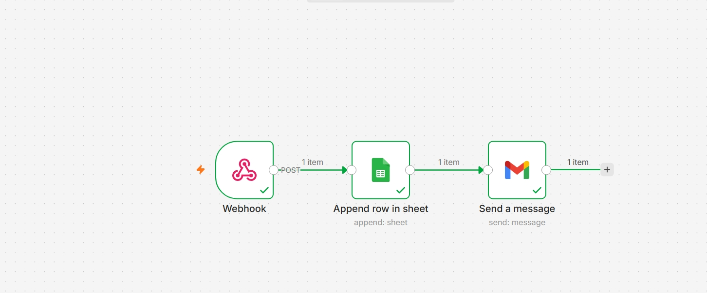
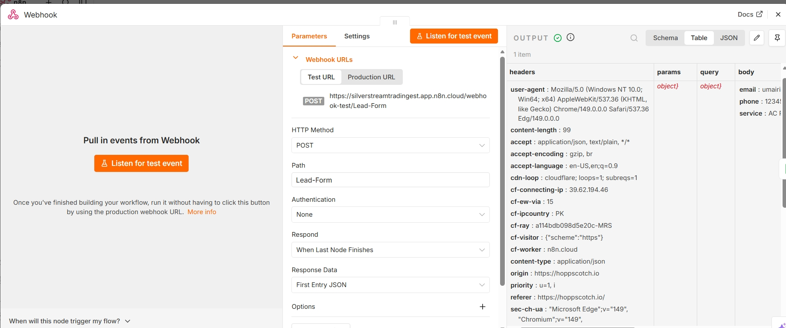
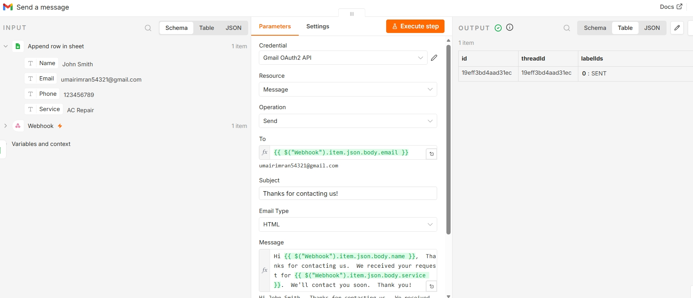

# Website-Ai-Lead-Automtion
n8n Workflows Portfolio

This repository contains the n8n workflows I've built while learning workflow automation and AI integrations.

The goal of this repository is to practice building real-world automations using webhooks, APIs, Google Workspace, email services, AI models, and business applications.

Current Workflows
1. Lead Form → Google Sheets → Gmail

Description

Automatically captures lead information from a webhook, saves it to Google Sheets, and sends a thank-you email through Gmail.

Workflow

Webhook
   ↓
Google Sheets
   ↓
Gmail

Skills Practiced

Webhooks
Google Sheets integration
Gmail integration
Data mapping
Workflow testing

More workflows will be added as I continue learning n8n.

Technologies
n8n
Google Sheets
Gmail
Webhooks
JSON
Learning Goals
Build production-ready automations
Learn API integrations
Practice AI workflows
Create reusable business automations
Future Workflows
Gmail → Google Drive
AI Lead Qualification
RSS Feed → AI Summary
CRM Automation
Social Media Scheduler
Weather Alerts
Research Assistant
## Current Workflows

- ✅ Lead Form → Google Sheets → Gmail
- ✅ Gmail Attachment → Google Drive
- ✅ RSS Feed → AI Summary → Telegram
- ⏳ AI Lead Qualification
- ⏳ CRM Duplicate Checker

# Lead Form → Google Sheets → Gmail

## Workflow

## Input

## Output

